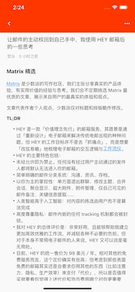

# Reed

Simple RSS Reader based on [Miniflux](https://miniflux.app/) API

## ScreenShot

## Features

- support dark mode
- i18n enabled
- simple and clean theme

## Develop
make sure finish [install Flutter](https://flutter.io/get-started/install/) successful

1. clone this repo
`git clone https://github.com/ali322/reed`
2. install all the packages
`flutter packages get`
3. run the app in simulator on your own
`flutter run`

## Packages in using
Reed build on following packages
* [http](https://pub.dev/packages/http)
* [bloc](https://pub.dev/packages/bloc)
* [flutter_html](https://pub.dev/packages/flutter_html)
* [easy_localization](https://pub.dev/packages/easy_localization)
* [flutter_secure_storage](https://pub.dev/packages/flutter_secure_storage)
* [url_launcher](https://pub.dev/packages/url_launcher)

## Todo

- finish more scenes
- fix some unknow bugs

## License

[MIT License](http://en.wikipedia.org/wiki/MIT_License)